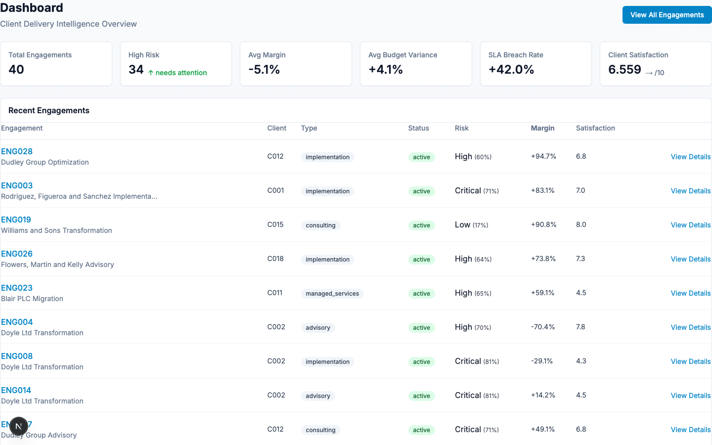
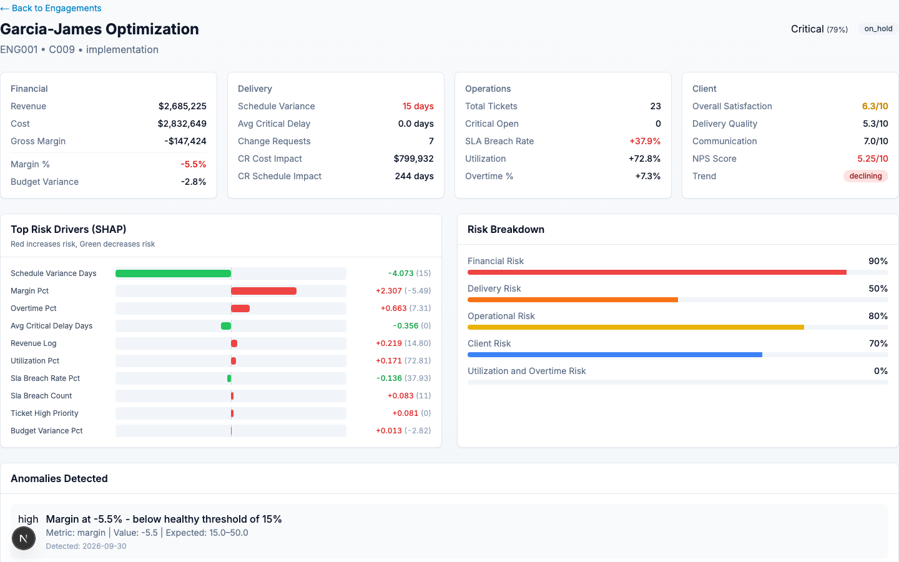
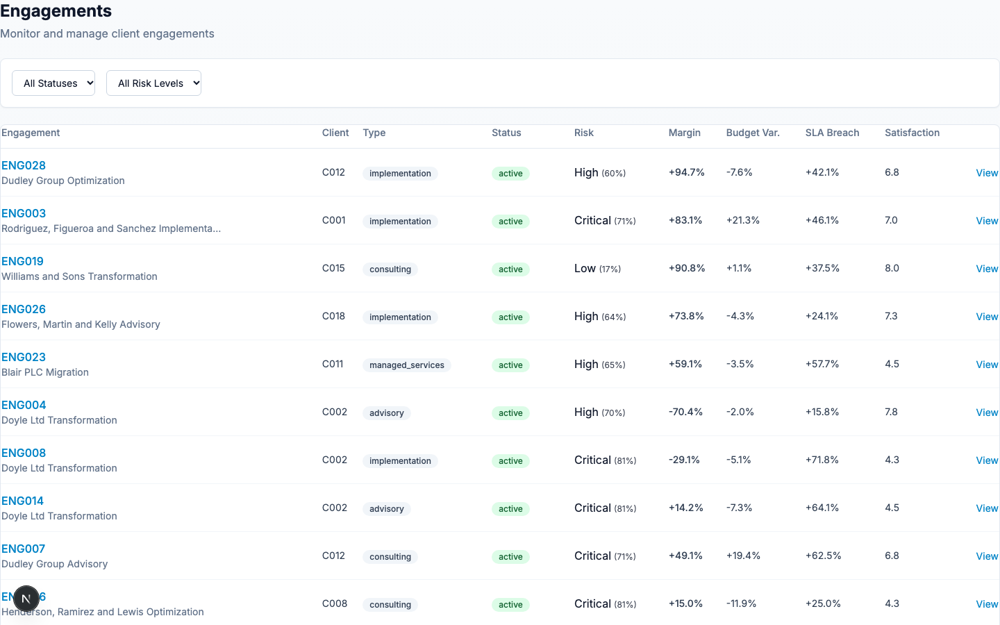
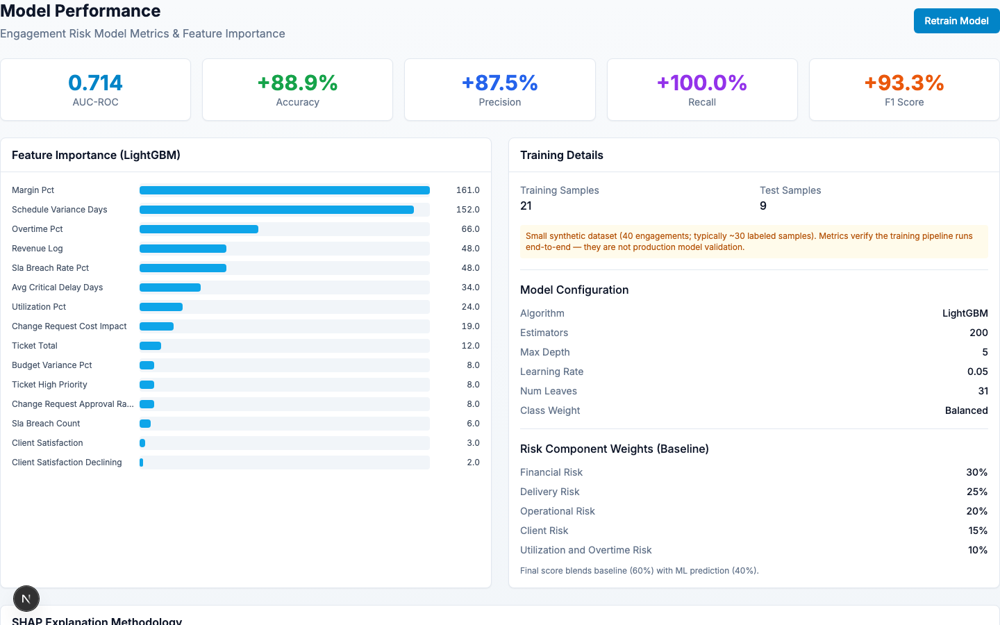

# EngageIQ

A dashboard for monitoring client engagements. It stores engagement data in SQLite, computes KPIs with Python, scores engagement risk with a LightGBM model, explains predictions with SHAP, and serves everything through a FastAPI backend and a Next.js frontend.

## Problem

Consulting teams track time, budgets, tickets, milestones, and client feedback in different places. When an engagement starts slipping, the warning signs are spread out and easy to miss. This project pulls that data together, calculates KPIs, scores risk, and shows what is driving the score.

## Features

- **Data Layer**: SQLite with 12 tables modeling clients, engagements, employees, timesheets, budgets, invoices, milestones, tickets, SLAs, change requests, and client feedback
- **Synthetic Data Generator**: Reproducible data with realistic patterns (healthy, financially deteriorating, delayed, high-change, high-ticket, SLA degradation, declining satisfaction, utilization issues)
- **KPI Analytics**: Revenue, cost, margin, budget variance, schedule variance, ticket backlog, SLA breach rate, change request rate, utilization, client satisfaction
- **Risk Model**: Interpretable baseline + LightGBM with configurable weights (financial 30%, delivery 25%, operational 20%, client 15%, data quality 10%)
- **SHAP Explanations**: Top feature contributions to the LightGBM model's predicted risk probability (the ML part of the blended score, not the final composite)
- **Anomaly Detection**: Statistical detection of utilization spikes, margin deterioration, ticket surges, SLA degradation, change request growth, satisfaction declines
- **RAG Knowledge Base**: 5 policy documents with semantic search (delivery playbook, SLA policy, escalation policy, margin management, project governance)
- **AI Investigation**: Tool-based agent orchestration for natural-language queries when an LLM key is configured; otherwise a labeled mock answer
- **Dashboard**: Portfolio overview, engagement details, investigation UI, model performance

## Tech Stack

| Layer | Technology |
|-------|------------|
| Backend | Python, FastAPI, SQLAlchemy |
| Database | SQLite (bundled synthetic dataset) |
| Analytics | Pandas, NumPy |
| ML | LightGBM, SHAP |
| Frontend | Next.js, React, TypeScript, Tailwind CSS |
| Infrastructure | Docker, Docker Compose |

## Screenshots

### Portfolio Dashboard


### Engagement Risk Analysis


### Engagement Portfolio


### Model Performance


## Quick Start

### Prerequisites

- Python 3.11+ and Node.js 20+ for manual setup (Docker images use Python 3.12), or Docker & Docker Compose
- (Optional) An external LLM API key for live investigation (otherwise the investigation endpoint returns clearly labeled mock responses)

### Local Development

```bash
# Clone and navigate
git clone https://github.com/sankethvarma1/EngageIQ.git
cd EngageIQ
```

The frontend and backend run as two separate processes, so use two terminals
and keep both open while using the dashboard.

Terminal 1 — backend:

```bash
cd backend
python3 -m venv .venv
source .venv/bin/activate
pip install -r requirements.txt

# The bundled backend/engageiq.db already contains 40 synthetic engagements.
FRONTEND_URL=http://localhost:3001 python -m uvicorn app.main:app --reload
```

Terminal 2 — frontend:

```bash
cd frontend
npm ci
npm run dev -- --port 3001
```

Open **http://localhost:3001/dashboard**. The backend API is at
**http://localhost:8000**, with interactive docs at
**http://localhost:8000/docs** and a health check at
**http://localhost:8000/health**.

These are the exact settings this setup was tested with. `FRONTEND_URL` must
match the frontend origin or the browser blocks API calls (CORS). If port
3001 is taken on your machine, use another port and update both the URL and
`FRONTEND_URL` to match.

To enable live investigation answers instead of mock responses, copy
`.env.example` to `backend/.env` and set `NEMOTRON_API_KEY` there (or export
it in Terminal 1 before starting the backend).

## Environment Variables

| Variable | Description | Required |
|----------|-------------|----------|
| `DATABASE_URL` | SQLite URL (defaults to `sqlite:///./engageiq.db` when run from `backend/`) | No |
| `NEMOTRON_API_KEY` | External LLM API key (enables live investigation answers; otherwise mock) | No (uses mock) |
| `NEMOTRON_BASE_URL` | External LLM API endpoint (OpenAI-compatible chat completions) | No |
| `RISK_MODEL_WEIGHTS` | JSON string of risk component weights | No |
| `ALLOW_MODEL_RETRAIN` | Set `false` to disable `POST /model/retrain` (demo protection) | No |
| `FRONTEND_URL` | Public frontend origin for backend CORS | No (local default) |
| `NEXT_PUBLIC_API_URL` | Backend API URL (defaults to `http://localhost:8000/api`) | No |
| `NEXT_PUBLIC_ALLOW_RETRAIN` | Set `false` to hide the demo retrain button | No |

## Database Schema

Key tables:
- `clients` - Client master data
- `engagements` - Core engagement records
- `employees` - Staff directory
- `employee_assignments` - Staffing allocations
- `timesheets` - Weekly hours (billable/non-billable/overtime)
- `budgets` - Planned vs actual by category
- `invoices` - Billing records
- `milestones` - Delivery milestones with dates
- `tickets` - Support/defect tickets
- `sla_events` - SLA measurements and breaches
- `change_requests` - Scope change tracking
- `client_feedback` - Survey responses (1-10 scales + NPS)

## ML Pipeline

### Risk Scoring

The risk model combines:
1. **Interpretable Baseline** (60% weight): Rule-based scoring across 5 risk dimensions
2. **LightGBM Model** (40% weight): Trained on synthetic historical engagement outcomes (rule-derived labels, see target variable below)

Target variable: Binary high-risk label derived from margin < 10%, schedule variance > 30 days, SLA breach > 20%, satisfaction < 5.

**Dataset size disclaimer**: The bundled synthetic dataset is small (40 engagements; typical retrain yields ~30 labeled samples, e.g. 21 train / 9 test). Reported metrics (AUC, accuracy, precision, recall, F1) are computed from real predictions but are not statistically meaningful at this sample size. Treat them as pipeline verification, not production model validation.

### SHAP Explanations

TreeSHAP provides per-engagement feature contributions for the trained LightGBM model output (the 40% ML component of the risk score, not the blended composite). The UI shows top 10 drivers with directionality (red = increases risk, green = decreases risk).

**Important**: SHAP explains model behavior, not causality. Features may be correlated proxies.

## API Endpoints

| Method | Endpoint | Description |
|--------|----------|-------------|
| GET | `/health` | Health check |
| GET | `/api/engagements` | List engagements |
| GET | `/api/engagements/{id}` | Get engagement |
| GET | `/api/engagements/{id}/kpis` | Calculate all KPIs |
| GET | `/api/engagements/{id}/risk` | Get risk score & breakdown |
| GET | `/api/engagements/{id}/anomalies` | Detect anomalies |
| GET | `/api/engagements/{id}/explanation` | SHAP feature contributions |
| POST | `/api/ai/investigate` | AI-powered investigation |
| GET | `/api/engagements/model/metrics` | Model performance metrics |
| POST | `/api/engagements/model/retrain` | Retrain risk model |

## Agent Tools

The AI investigator orchestrates these deterministic tools:
- `query_engagement` - Basic engagement info
- `calculate_kpis` - Full KPI computation
- `calculate_risk` - Risk score with breakdown
- `get_shap_explanation` - SHAP feature contributions
- `detect_anomalies` - Statistical anomaly detection
- `retrieve_evidence` - RAG knowledge base search

**LLM mode**: Without `NEMOTRON_API_KEY`, `/api/ai/investigate` runs in mock mode — the endpoint, tool schemas, and evidence plumbing are real, but the final narrative is a labeled placeholder (`[Mock Response]...`), not a live model answer. Set the key to enable live external-LLM responses. Never present mock output as model-generated analysis.
In mock mode, the provider returns a placeholder without calling the investigation tools; the response has empty `tool_calls` and `evidence` arrays. Semantic retrieval downloads the embedding model on first use and requires internet access then.

## Testing

```bash
# Backend tests
cd backend
pytest app/tests -v

# Frontend production build and TypeScript check
cd frontend
npm ci
npm run build
npm run typecheck
```

## Project Structure

```
EngageIQ/
├── backend/
│   ├── app/
│   │   ├── api/v1/          # FastAPI routes
│   │   ├── analytics/       # KPI & anomaly calculations
│   │   ├── agents/          # Tool-based agent orchestration
│   │   ├── core/            # Config, LLM provider
│   │   ├── db/              # SQLAlchemy models, session
│   │   ├── ml/              # Risk model, SHAP
│   │   ├── rag/             # Knowledge base, embeddings
│   │   └── main.py          # FastAPI app
│   ├── scripts/
│   │   └── generate_data.py # Synthetic data generator
│   ├── requirements.txt
│   ├── engageiq.db      # Bundled synthetic data
│   └── models/          # Saved LightGBM model and metrics
├── frontend/
│   ├── src/
│   │   ├── app/             # Next.js App Router pages
│   │   ├── components/      # React components
│   │   ├── lib/             # API client, utilities
│   │   └── types/           # TypeScript types
│   └── package.json
├── docs/
│   ├── knowledge_base/      # RAG documents
│   └── architecture.md
├── docker/
│   ├── docker-compose.yml
│   ├── Dockerfile.backend
│   └── Dockerfile.frontend
├── render.yaml
├── .env.example
└── README.md
```

## Current Limitations

- The dataset contains 40 synthetic engagements, so model metrics are for pipeline validation rather than production evaluation.
- Investigation uses labeled mock responses unless an external LLM key is configured.
- The application is single-tenant and does not include user authentication.
- Retraining is synchronous and intended for controlled local use.

## License

MIT License — see [LICENSE](LICENSE). Portfolio project for demonstration purposes.
